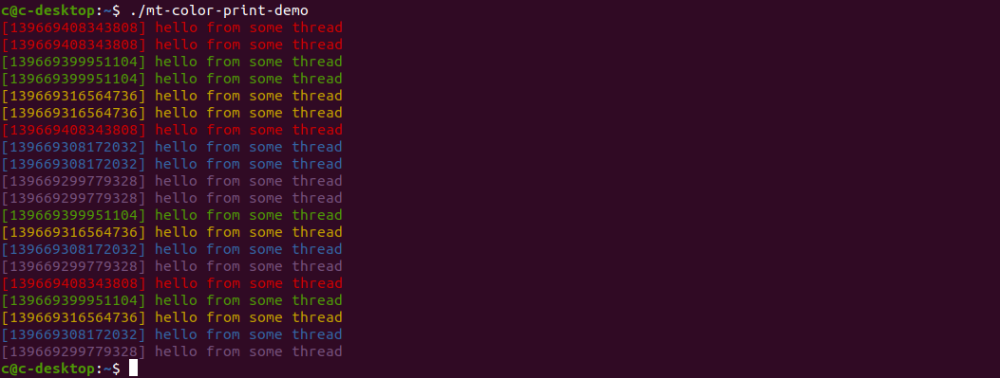

# mt_color_print

Single header library with **simple**, `printf`-like, thread-safe methods for printing colorized debug info to `std::cout`.


## Description

- prints to `std::cout`
- thread-safe
- prints the thread's id
- each thread a different colour


## Getting Started

Just 
```c++
#include "mt_color_print.hpp"
```
and do not forget to link with `pthread`


### Requirements

C++17


## API description

### mt_color_print::print

```c++
template<typename ... Ts>
void print(Ts && ... args)
```
Print `args` to `std::cout`, without being interrupted by other threads, and preceded by a (perhaps colorized) string representation of the thread's id, between brackets.
Print a space between each adjacent arg.

Params:
- `...args` arguments, of printable types (i.e. having an extraction to `std::ostream` operator overload)


#### Example

```c++
#include "mt_color_print.hpp"

int x = -82;
bool b = true;

mt_color_print::print(3.14f,x,b,std::string("hello"),"hello again");
```

output:
```
[140485091915520] 3.14 -82 1 hello hello again
```


### mt_color_print::print_range

```c++
template<typename Iter>
void print_range(Iter from, Iter to)
```
Print items in the iterator range [from,to) to `std::cout`, without being interrupted by other threads, and preceded by a (perhaps colorized) string representation of the thread's id, between brackets. Each item on its own line.

Params:
- `from`  iterator pointing to the first element, which must be of a printable type (i.e. having an extraction to `std::ostream` operator overload)
- `to`    iterator pointing to one past the last element, which must be of a printable type (i.e. having an extraction to `std::ostream` operator overload)


#### Example

```c++
#include "mt_color_print.hpp"

std::vector<int> v{1,2,3,4};

mt_color_print::print_range(v.cbegin(),v.cend());
```

output:
```
[140485091915520] 
1
2
3
4
```


### mt_color_print::set_color_enabled()

```c++
void set_color_enabled(bool enable)
```
Enable/disable colorized output. Thread-safe, valid for every thread

Params:
- `enable` boolean value


### mt_color_print::is_color_enabled()

```c++
bool is_color_enabled()
```
Tell if coloring of output is enabled.


# Demo

See [demo/mt_color_print-demo.cpp](demo/mt_color_print-demo.cpp) (use [demo/compile.sh](demo/compile.sh) to compile)


## Demo screenshot




## License

Distributed under the MIT License. See LICENSE.txt for more information.


## Contact

[https://github.com/straykangaroo/mt_color_print](https://github.com/straykangaroo/mt_color_print)
